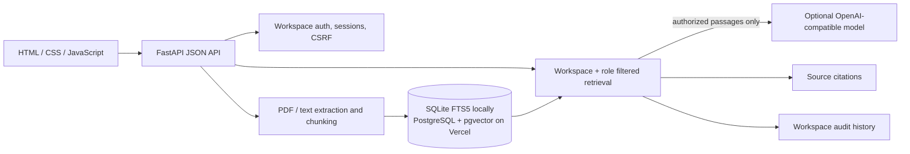

[Live demo](https://permission-aware-rag.vercel.app/) · [Source repository](https://github.com/MuhammadSaabiqkader/permission-aware-rag)

# Keyline — Permission-Aware Document Intelligence

Keyline is a full-stack document question-answering app built with FastAPI. It lets a team upload PDFs, text, or Markdown, then retrieve answers from the documents a signed-in user is allowed to see. Workspace and role checks run as part of retrieval, before source passages can reach the optional language model.

> **Sample content:** The six PDFs in [`sample-documents/`](sample-documents/) are fictional portfolio data. They are included so the project can be tried without uploading private company files.

## What it does

- **Workspaces and accounts:** password login, salted scrypt password hashes, server-side sessions, HttpOnly cookies, and CSRF protection for changes.
- **Document library:** upload selectable-text PDF, UTF-8 text, or Markdown files up to 5 MB. Documents are split into overlapping passages for retrieval.
- **Role-aware access:** `admin`, `analyst`, and `member` roles. Every document and passage is scoped to its workspace; role filters are applied in the retrieval query.
- **Grounded answers:** source passages are returned with citations. With an OpenAI-compatible API key, Keyline can synthesize an answer from authorized passages; without one, it returns the retrieved excerpts.
- **Hybrid retrieval:** SQLite FTS5 keyword retrieval works locally without an API key. Add an embedding API key to enable vector similarity locally; PostgreSQL with pgvector provides indexed vector retrieval for deployment.
- **Audit history:** each question records the user, query, and retrieved document IDs. Admins can review workspace activity; other roles see their own events.
- **Sample library:** an admin can load all six included PDFs from the Library screen. The action is safe to repeat and reports documents already present.

## Try the sample workspace

1. Create a workspace and its first admin account. Passwords must be at least 12 characters.
2. Open **Library** and select **Load six sample documents**.
3. Open **Ask** and try questions such as:
   - `What is the remaining project budget?`
   - `What are the onboarding steps?`
   - `What risks are listed for Project Apollo?`
4. Add an analyst or member account from the workspace screen and compare which sample files each role can see.

### Sample document access

| Sample PDF | Keyline access |
| --- | --- |
| Employee Handbook | Everyone |
| Onboarding Policy | Everyone |
| Project Apollo | Analyst and admin |
| Project Risks | Analyst and admin |
| Financial Report 2026 | Admin only |
| Management Strategy 2026 | Admin only |

The sample documents refer to Finance and Management groups, which this app does not model separately. To apply least privilege with the roles available in Keyline, the financial and management documents are admin-only, while the project documents are analyst/admin. The source PDFs identify their contents as fictional.

## Run locally

Requires Python 3.10 or newer.

```powershell
python -m venv .venv
.venv\Scripts\Activate.ps1
python -m pip install -r requirements.txt
python -m uvicorn app:app --reload --host 127.0.0.1 --port 8000
```

Open [http://127.0.0.1:8000](http://127.0.0.1:8000). By default, local development uses SQLite at `storage/keyline.sqlite3`.

### Optional AI and embeddings

The app works without an AI provider: keyword search and source excerpts remain available. Configure an OpenAI-compatible service in the server environment to enable semantic embeddings and generated answers:

```powershell
$env:OPENAI_API_KEY = "your-key"
$env:OPENAI_MODEL = "gpt-4o-mini"
$env:OPENAI_EMBEDDING_MODEL = "text-embedding-3-small"
# Optional compatible endpoint, for example a provider exposing the OpenAI API shape:
# $env:OPENAI_BASE_URL = "https://provider.example/v1"
```

Embedding and answer requests send document passages and questions to the configured provider. Only passages allowed for the current user are sent for answer generation. Do not use confidential data with an external provider unless that use is approved for your organization. Keep keys on the server; never commit them or put them in frontend code.

## Deploy on Vercel

Vercel can deploy the FastAPI application from this GitHub repository. The app requires a persistent PostgreSQL database in production because files written to a function's local filesystem are temporary. It also uses pgvector for vector search when embeddings are configured.

1. Import `MuhammadSaabiqkader/permission-aware-rag` into Vercel.
2. Connect a managed PostgreSQL provider with the `vector` extension (for example, Neon through the Vercel Marketplace). Set `DATABASE_URL` or `POSTGRES_URL` from the provider's connection string in the Vercel project environment.
3. Redeploy. On startup, Keyline creates its schema and indexes. The app enables secure cookies automatically on Vercel.
4. Optionally add `OPENAI_API_KEY`, `OPENAI_MODEL`, and `OPENAI_EMBEDDING_MODEL` as server-side environment variables for generated answers and hybrid semantic retrieval.
5. Create a workspace on the live site and load the sample PDFs from the Library page.

Vercel's [FastAPI guide](https://vercel.com/docs/frameworks/backend/fastapi) describes the Python deployment behavior. The repository intentionally excludes databases, virtual environments, and secrets. Never commit a live database URL or provider key.

## Architecture



## Portfolio copy

**Resume:** Built Keyline, a full-stack FastAPI document Q&A application with workspace isolation, role-filtered retrieval, PDF ingestion, citations, and auditable query history; added SQLite keyword search and optional PostgreSQL/pgvector hybrid retrieval and LLM answer generation.

**LinkedIn project description:** Keyline is a permission-aware document intelligence app I built with FastAPI and a responsive web interface. It ingests PDF, text, and Markdown files, enforces workspace and role access during retrieval, returns source-grounded answers, and records retrieval activity. It runs locally with SQLite and supports PostgreSQL/pgvector and an optional OpenAI-compatible model for deployment.

## Current scope

- PDF text extraction requires selectable text; scanned PDFs need OCR.
- The project is a portfolio implementation, not a security certification. Before using it for real company data, add production account recovery and verification, stronger persistent rate limiting, operational monitoring, backup/restore procedures, and a security review.
- The six bundled PDFs are illustrative synthetic material, not real company records.
